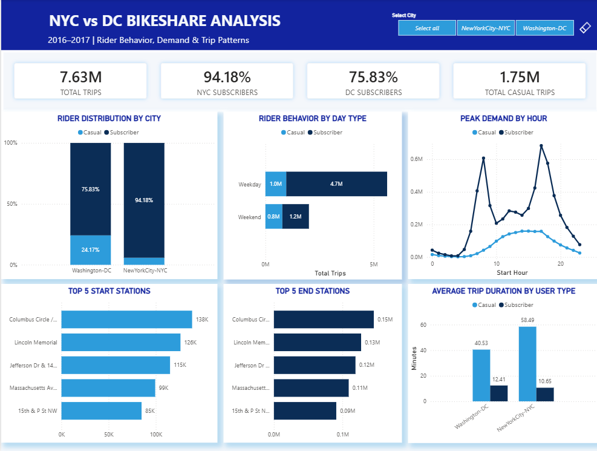

# NYC vs DC Bikeshare Analysis

**How do rider behavior, demand, and trip patterns differ between New York City and Washington, DC?**

Power BI + SQL | 2016–2017 | Group Data Analytics Project, General Assembly (DAB 26)

## Overview

This project compares bikeshare activity in New York City and Washington, DC using Citi Bike and Capital Bikeshare data from 2016 and 2017.

The analysis focuses on rider type, weekday and weekend behavior, peak demand by hour, station activity, and trip duration. The final Power BI dashboard brings both cities into one interactive view for direct comparison.

## Dashboard



The dashboard was built in Power BI. The original `.pbix` file is not included in this repository because of its file size, so a full dashboard preview is provided above.
## Key Findings

1. Across both systems, the analysis covers **7.63 million trips**.

2. New York City had a higher subscriber share, with **94.18%** of trips made by subscribers compared with **75.83%** in Washington, DC.

3. Subscriber activity was strongest on weekdays, while casual riders represented a larger share of weekend trips.

4. Hourly demand showed clear commuting patterns among subscribers, with stronger peaks during typical morning and evening travel periods.

5. Casual riders took longer trips on average in both cities. Average casual trip duration was **40.53 minutes in Washington, DC** and **58.49 minutes in New York City**, compared with **12.41 minutes** and **10.65 minutes** for subscribers.

The analysis also identifies the most frequently used start and end stations to show where trip activity is concentrated.

## Analysis

The project compares rider distribution between the two cities, weekday and weekend behavior, hourly demand patterns, the most active start and end stations, and average trip duration by rider type.

SQL was used as part of the data analysis workflow, while Power BI was used to build the interactive dashboard and present the final comparisons.

## My Contribution

This was a group project with shared responsibility for the Power BI analysis, dashboard development, and visualizations.

My contribution also included developing the **problem statement, recommendations, and project limitations** used to frame the analysis and communicate the findings.

## Data

| Dataset           | Coverage                                       |
| ----------------- | ---------------------------------------------- |
| Citi Bike         | New York City trip data for 2016 and 2017      |
| Capital Bikeshare | Washington, DC trip data for 2016 and 2017     |
| Station data      | Station information for both bikeshare systems |

The repository includes the datasets that fit within GitHub's standard file size limits. The 2016 and 2017 Capital Bikeshare trip files are not included because both exceed GitHub's 100 MB per file limit.

The analysis and dashboard were completed using the full datasets.
## Tools

`SQL` · `Power BI`

## Repo Contents

```text
NYC_vs_DC_Bikeshare_Analysis/
├── README.md
├── Dashboard.png
├── datasets/
│   ├── capitalbikeshare_stations.csv
│   ├── citibike-2016.csv
│   ├── citibike-2017.csv
│   └── citibike-stations.csv
└── presentation/
    └── Abeer_Radhi_CitiBikeshare_lab.pdf
```

## Limitations

The analysis covers 2016 and 2017, so the findings represent bikeshare behavior during that period rather than current demand.

New York City and Washington, DC have different populations, transport systems, geography, and operating environments. The dashboard describes differences in observed usage but does not establish what caused those differences.

Trip records capture how the systems were used, but they do not explain individual rider motivations or travel purpose.

---

**Abeer Radhi** · LinkedIn: [www.linkedin.com/in/abeerradhi](https://www.linkedin.com/in/abeerradhi/)
